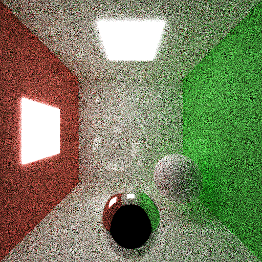
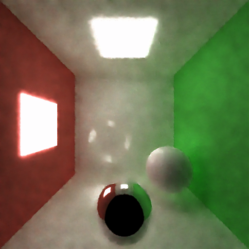
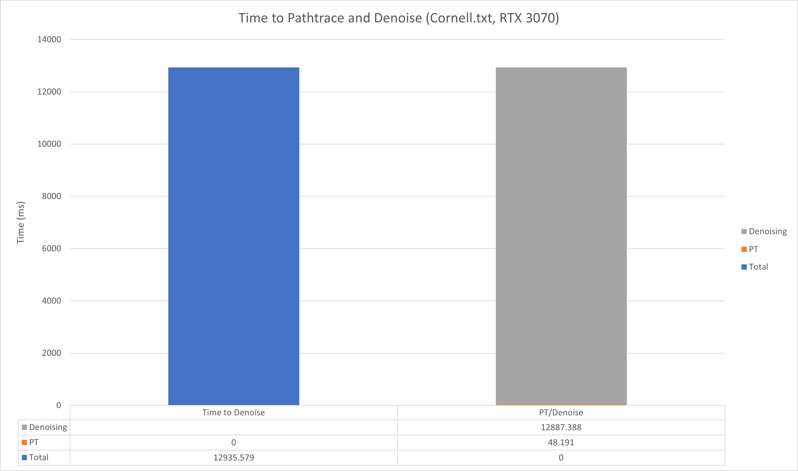

[Pitch](https://docs.google.com/presentation/d/1y1yV0J7CyVD8jc_lO0PWT8My7wSFG6huEi9DV5qEQxY/edit#slide=id.p)
# Real Time Denoising for CUDA Pathtracer using cuDNN
**University of Pennsylvania, CIS 565: GPU Programming and Architecture, Final Project**

- Members: Tom Donnelly, Shixuan Fang, [Ryan Tong](https://www.linkedin.com/in/ryanctong/)

- Tested on: Windows 10, i7-7700HQ @ 2.8GHz (3.8 Boost) 32GB, External RTX 3080, 11G (personal laptop) TODO ADD UR COMPUTER SPECS HERE @TOM

# TODO ADD FINAL GIF / DEMO VIDEO HERE

This project aims to create a real time denoiser based on [DNCNN](https://arxiv.org/abs/1608.03981) convolutional model. We modify the model proposed in the paper to include Gbuffer data as input channels and to be fined tuned on path traced scenes from the path tracer implemented in the class. Our goal is to implement this fine-tuned model into the path tracer and optimize it so that we can get real time results. We also provide a data generation pipeline, scene creation uitilit, and other utility programs.

## Results (Visual)

## TODO INSERT GIFS AND IMAGES AND WHAT NOT HERE

## Results (Performance)

## TODO INSERT PERFORMANCE STUFF HERE

## Path Tracer
This project uses a path tracer implemented in C++ and uses CUDA for GPU speed up. Specifically, the path tracer shoots out rays from the camera and bounces the rays around to accumulate a color and does this over many iterations to generate an image. By using path tracing, we are able to render images with features such as global illumination, color bleed, and 'free' soft shadows. The code for the path tracer that this project is based off of is from Shixuan Fang and can be found [here]TODO ADD REPO LINK.

## Path Tracer Features
The path tracer has the following features and they can be enabled in the following areas of code ... TODO COMPLETE THIS

performance analysis for Bounding Volumn Hierarchy

## Data Generation
  
Based in the data-gen branch, this program saves GBuffer data as well as path traced images at different sample rates for use in training. 
To run data collection Use:  
`..\run_datagen.py --path ..\scenes\ --a NUM_CAMERA_ANGLE --loop (0 or 1)`
We were able to generate a dataset of _ images acros _ scenes which is then used to fine tune the denoising model. TODO ADD NUMBERS. The data generator will randomly select a camera angle and position from a certain range of realistic angles TODO MORE DETAIL HERE... For each selected angle/position, the first 1-16 spp noisy images will be saved for training along with the GBuffer after 1 spp. Then a 'ground truth' image will be saved at 5000 spp. The GBuffer data we collect are the normal and position of each TODO MORE DETAILS?

## Scene Generation 
TODO ADD IMAGES AND DESCRIBE SCENE GENERATION AND A FEW SENTENCES ON HOW IT WORKS

## Denoising
    

## Denoising with DNCNN
We implement the DNCNN denoising model in the path tracer using cuDNN to get maximal perforamce. Firstly we run a python script to load a pytorch check point with trained model weights. We write these model weights to .txt files to be read by the path tracer. Note that we use condense batch normaization layers into the convolutional layers after training to reduce computation (done in pytorch). On the path tracer start up, these .txt files are read and loaded into cuDNN kernels and biases. Then an image generated from the path tracer can be ran through the weights and biases and outputted back into the PBO to be dispayed.

To use: Make sure denoise_on is true in pathtrace.cu.

## Model Architecture
The DNCNN is a fully convolutional model that is able to learn a noise residual which is then subtracted from the original image to get a 

## Model Training
We fine tune the model using the collected dataset so that we get better denoising performance on the path traced scenes. We fine-tune by using training code and a trained model provided by the author [here](https://github.com/cszn/KAIR). The authors trained model weights can be downloaded [here](https://drive.google.com/drive/folders/13kfr3qny7S2xwG9h7v95F5mkWs0OmU0D). Specifically, we use the noise blind color DNCNN model which is trained on noisy color images from the [CBSD68 dataset](https://github.com/cszn/FFDNet/tree/master/testsets/CBSD68). We modify the authors code repo to better suit our training task in [this repo]() TODO LINK TO TRAINING FORK. 

## Model Results
We first fine tuned the DNCNN model as is using our collected dataset and got the following results:
TODO ADD IMAGES OF 1SPP VS 16SPP VS DENOISED VS GT

## Smaller Model Results
We then decided to halve the number of layers to 10 and incoorperate GBuffer data into the input channel (increasing it from 3-9) to get faster inference speed due to less layers of convolution.
TODO ADD IMAGES OF 1SPP VS 16SPP VS DENOISED VS GT

## Loading Model in Path Tracer

## Integration into Path Tracer
We decided on two ways to have the denoising model implemented into the path tracer. Firstly, we have a customizable version where the user can choose how many iterations between denoising and to toggle denoising on and off. The iterations without denoising only do path tracing but are not shown in the output image. Instead, the path traced image is stored internally and ran through the denoiser when a denoising iteration occurs. This means the output image only changes every n iterations where n is set by the slider. 

## Exponential Denoising
The second version of the denosing path tracer is one that does denoising exponentially less often (1st frame, 2nd frame, 4th frame, 8th frame etc). The reasoning behind this version is that the contribution of path tracing is not linear and is diminishing returns. This is mirrored by our denoising frequency with the idea that there is little change between iterations, we should denoise less often to improve performance. This version is in the exponential branch.

## Run the Denoiser
To run the denoiser, set the desired scene in the command arguments. Then set the `num_layers` and `use_gbuff' parameters in `main.cpp` to the model architecture (true, 10 for half size mode, false and 20 for default model). Set the `model_path` parameter to the directory that contains model weights in csv form. The directory should be in the form: "path\\to\\repo\\Real-Time-Denoising-And-Upscaling\\dnCNN\\weights_small\\".

## Performance
  
We examine the performance of a single iteration of both path tracing and denoising. The perforamce is conducted on the Cornell box scene with 3 spheres and ran on the hardware described above. The initial performance of denoising was a super long 12 seconds. We made several major optimizations to reduce this to ~3ms. The results are pictured above and each optimation is explained below.

## TODO OPTIMIZATION DESCRIPTIONS

