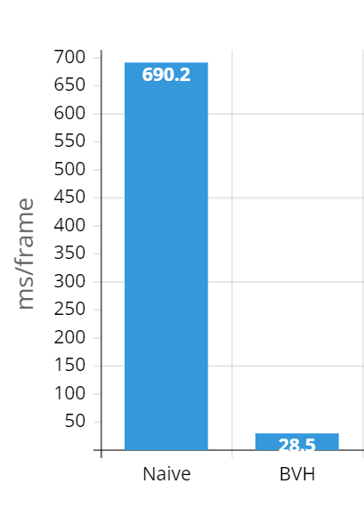

# Real Time Denoising for CUDA Path Tracer using cuDNN
**University of Pennsylvania, CIS 565: GPU Programming and Architecture, Final Project**

- Members: [Tom Donnelly](https://www.linkedin.com/in/the-tom-donnelly/), [Shixuan Fang](https://www.linkedin.com/in/shixuan-fang-4aba78222/), [Ryan Tong](https://www.linkedin.com/in/ryanctong/)

- Tested on: Windows 11, AMD Ryzen 9 5900X, NVIDIA GeForce RTX 3070 (Personal Desktop)


This project aims to create a real time denoiser based on [DNCNN](https://arxiv.org/abs/1608.03981) convolutional model. We modify the model proposed in the paper to include Gbuffer data as input channels and to be fine tuned on path traced scenes from the path tracer implemented in the class. Our goal is to implement this fine-tuned model into the path tracer and optimize it so that we can get real time results. We also provide a data generation pipeline, scene creation utility, and other utility programs.

## Results (Visual)

https://user-images.githubusercontent.com/42314888/206960867-7cdd6793-c211-4361-beea-ca3f2f10270b.mp4


## Results (Performance)


## Path Tracer
This project uses a path tracer implemented in C++ and uses CUDA for GPU speed up. Specifically, the path tracer shoots out rays from the camera and bounces the rays around to accumulate a color and does this over many iterations to generate an image. By using path tracing, we are able to render images with features such as global illumination, color bleed, and 'free' soft shadows. The code for the path tracer that this project is based off of is from Shixuan Fang and can be found [here](https://github.com/horo-ursa/Project3-CUDA-Path-Tracer).

## Path Tracer Features
The path tracer has the following features and they can be enabled in the following areas of code:

 
Cache first ray bounces: `#define CACHE_FIRST_BOUNCE 1` in pathtrace.cu  

 Material memory sorting `#define SORT_MATERIAL 1` in pathtrace.cu  

 Stream compaction `#define COMPACTION 1` in pathtrace.cu    
 
OBJ and scene file loading, supply an obj file in the form ```OBJECT_obj ../scenes/filename.obj
TRANS  	 4 8.5 -4.75
ROTAT  	 0 0 0
SCALE  	 0.1 0.1 0.1
MATERIAL	3```   
     Bound volume hierarchy was also implemented to improve path tracing speed when complex objects are used. The performance gains can be seen below (lower is better).  




## Data Generation
  

Based in the data-gen branch, this program saves GBuffer data as well as path traced images at different sample rates for use in training.
To run data collection Use:  
`..\run_datagen.py --path ..\scenes\ --a NUM_CAMERA_ANGLE --loop (0 or 1)`
We were able to generate a dataset of 26,000 images across 160 scenes which is then used to fine tune the denoising model. The data generator will randomly select a camera angle and position from a certain range of realistic angles based on the resolution of the images and rotate the camera.  For each selected angle/position, the first 1-16 sample per pixel (spp) noisy images will be saved for training along with the GBuffer after 1 spp. Then a 'ground truth' image will be saved at 5000 spp. The GBuffer data we collect are the normal and position of each pixel after intersecting with an object in the scene.

## Scene Generation
The scene generation script works by randomizing the types of objects, materials, positions, and poses of objects to generate new scenes to be used for data collection. There is some smart checking to make sure that objects do not collide too often. The code for this script can be found in `scene_generator\scene_generator.cpp`.

Example 1 | Example 2
:-------------------------:|:-------------------------:
 |    

## Model Architecture

The DNCNN is a fully convolutional model that is able to learn a noise residual which is then subtracted from the original image to get a denoised image. The original model in the paper consists of 20 layers when denoising colored images. We modify the architecture to a more lightweight version that has half the layers (10) and takes in GBuffer data that is scaled down by a factor of 255.

## Model Training
We fine tune the model using the collected dataset so that we get better denoising performance on the path traced scenes. We fine-tune by using training code and a trained model provided by the author [here](https://github.com/cszn/KAIR). The authors' trained model weights can be downloaded [here](https://drive.google.com/drive/folders/13kfr3qny7S2xwG9h7v95F5mkWs0OmU0D). Specifically, we use the noise blind color DNCNN model which is trained on noisy color images from the [CBSD68 dataset](https://github.com/cszn/FFDNet/tree/master/testsets/CBSD68). We modify the author's code repo to better suit our training task in [this repo](https://github.com/tomvdon/GBuffer_DnCNN).

  
The model was trained using default DNCNN parameters and learning rates. It uses ADAM for optimization and trains using l1 loss. Peak Signal to Noise ratio is used to determine the quality of the image denoising in decibels. After including G Buffer information into training, the average PSNR improved significantly. 

## Model Input
We first fine tuned the DNCNN model as is using our collected dataset and got the following results:

Input | Input | Ground Truth
:-------------------------:|:-------------------------:|:-------------------------:
 |   |      
## Model Results

Model Output | Model Output | Ground Truth
:-------------------------:|:-------------------------:|:-------------------------:
 |    |  
Image after 1 spp of path tracing | Image after 16 spp of path tracing | Ground Truth

## Smaller Model Results
We then decided to halve the number of layers to 10 and incorporate GBuffer data into the input channel (increasing it from 3-9) to get faster inference speed due to less layers of convolution.

Model Output | Model Output | Ground Truth
:-------------------------:|:-------------------------:|:-------------------------:
 |    |  
Image after 1 spp of path tracing | Image after 16 spp of path tracing | Ground Truth

## Loading Model in Path Tracer
To read the model weights in the path tracer, we first need to convert the pytorch checkpoint to a more readable version. We do this in the `dnCNN/ptToCSV.py` script which converts the .pth files to CSVs with 2 CSVs per layer (filter weights and biases). The script is also capable of condensing batch normalization layers into the filter and bias weights using a utility script provided by the author. The directory containing the CSVs can then be used by the path tracer to load the model weights. An example command to run this script is: `python ptToCSV.py --weight_dir weights_bunny/ --cktpt_dir weights_bunny/bunny.pth --num_layers 10 --batch_norm True --gbuff True` (see `dnCNN/ptToCSV.py` for more details on what the arguments are used for).

## Verification
Input | Model Output | Final Image
:-------------------------:|:-------------------------:|:-------------------------:
  |   |  
The noisy input image | The noise residual outputted by the model | Denoised image (input - residual)

To verify that the output of the cuDNN implementation matches pytorch, we use `dnCNN/test_dncnn.py` to visualize the pytorch output as well as load in various debug outputs from the denoiser to compare with pytorch tensors. To run use `python test_dncnn.py`. Note that most of the debugging code is commented out / deleted in the main and exponential branches but you can see examples of a debug output in the various .txt files in the dnCNN directory.

## Integration into Path Tracer
We decided on two ways to have the denoising model implemented into the path tracer. Firstly, we have a customizable version where the user can choose how many iterations between denoising and to toggle denoising on and off. The iterations without denoising only do path tracing but are not shown in the output image. Instead, the path traced image is stored internally and ran through the denoiser when a denoising iteration occurs. This means the output image only changes every n iterations where n is set by the slider.

## Exponential Denoising
The second version of the denoising path tracer is one that does denoising exponentially less often (1st frame, 2nd frame, 4th frame, 8th frame etc). The reasoning behind this version is that the contribution of path tracing is not linear and is diminishing returns. This is mirrored by our denoising frequency with the idea that there is little change between iterations, we should denoise less often to improve performance. This version is in the exponential branch.

## Run the Denoiser
To run the denoiser, set the desired scene in the command arguments. Then set the `num_layers` and `use_gbuff` parameters in `main.cpp` to the model architecture (true, 10 for half size mode, false and 20 for default model). Set the `model_path` parameter to the directory that contains model weights in csv form. The directory should be in the form: "path\\to\\repo\\Real-Time-Denoising-And-Upscaling\\dnCNN\\weights_small\\".

## Performance
FPS | Runtime per Frame
:-------------------------:|:-------------------------:
  |  
Plot showing the FPS increase over the different optimizations made | Chart showing the runtime per frame (ms) for each optimization and the contribution of different elements.

We examine the performance of a single iteration of both path tracing and denoising. The performance is conducted on the Cornell box scene with 3 spheres and was ran on the hardware described above. The path tracing time and denoising time are the main contributors to runtime and the setup, cleanup, and PBO contributions are largely negligible. The initial performance of denoising was a super long 12 seconds. We made several major optimizations to reduce this to ~3ms. The main bottlenecks are path tracing time The results are pictured above and each optimization is explained below.

* Initial Version: This is the first implementation of a cuDNN forward pass over the model that was very unoptimized. The runtime of a single model pass was 13 seconds! Path tracing takes ~50 ms
* Setup Optimization: Changed the code such that instead of doing tensor and convolutional descriptor setup for each layer each time the model is run, do all the setup at the beginning of the program and destroy the descriptors at the end of the program. 13s -> 114ms
* Forward Fusion: Use a convolution + bias add + ReLu activation forward function provided in the cuDNN API instead of individual calls. 114ms -> 84ms
* Malloc Unblocking: Removed `cudaMalloc` and `cudaMemcpy` calls that were blocking inside the convolution forward loop. After this change, denoising was now faster than path tracing. 84ms -> 16ms.
* Smaller Model + GBuffer: Trained a lightweigh


t model with half the layers that also takes in GBuffer information as channels in the input. 16ms -> 4ms
* Material Sort: Disabled material sorting which can be slower for simple scenes that don’t have many different materials (This is an optimization purely to the path tracing side of the project). 50ms (path tracing) -> 20ms.

With all these changes we were able to achieve a runtime of ~24ms per frame (42.5 FPS)


